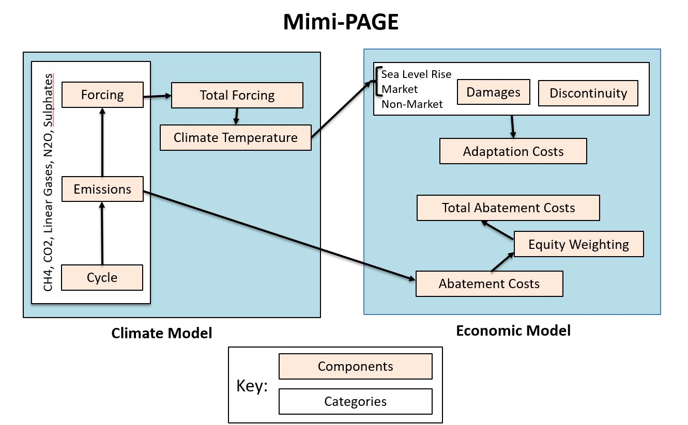

# Model Structure

## Overview

Mimi-PAGE is constructed to reflect the PAGE09 model structure, which features ten time periods and eight world regions. These time periods and regions are explicitly listed below. Climate change impacts for four sectors are calculated in addition to the costs of mitigation - herin referred to as abatement policies - and the costs of adaptation. Both impacts and costs can be computed under uncertainty.

This iteration of PAGE subsets the model into twenty-seven components, elaborated under the "Components" section below, and two basic parts: climate and economy. There are also a number of components particular to Mimi-PAGE which assist with certain functionalities. Within the climate model, gases and sulphates are split into three components each - namely "Cycle", "Emissions", and "Forcing." Forcings are then aggregated into "Total Forcing" and feed into "Climate Temperature." The economic model includes "Abatement Costs" and "Adaptation Costs", "Discontinuous"  impacts as well as impacts from "Sea Level Rise", "Market Damages", and "Non-Market Damages." It also features an "Equity Weighting" component.

A schematic of the model, and full listing of components, follows below.

## Time periods and regions

The ten uneven timesteps employed in Mimi-PAGE are 2009, 2010, 2020, 2030, 2040, 2050, 2075, 2100, 2150, 2200. The baseline period used, prior to any modeled results, is 2008.

The eight regions included are Europe(EU), the United States (USA), Latin America, the Organisation for Economic Co-operation and Development (OECD), the former Union of Soviet Socialist Republics (USSR), China, Southeast Asia, and Africa. Mimi-PAGE, like PAGE09, employs the EU as the baseline region. Therefore, several parameters throughout the model are given relative to their EU values.

## Sectors and gases

The model is divided into four impact sectors: sea level rise, market (called "economic" in PAGE09), non-market (called "non-economic" in PAGE09), and discontinuities. The six greenhouse gases of the Kyoto Protocol are each included via components that respectively model CO2, CH4, N2O, and a subset of low-concentration gases collectively termed "linear gases." Linear gases include HFCs, PFCs, and SF6. Sulphate forcing is also modelled.

The four impact sectors in Mimi-PAGE are modelled independently and reflect damages as a proportion of GDP. Sea level rise is a lagged linear function of global mean temperature. Both market and non-market impacts are designed to reflect the particular vulnerabilities of different regions, and use a polynomial function to reflect temperature differences over time. Discontinuity, or the risk of climate change triggering large-scale damages, features a variety of different possible types of disaster. Each of these are modelled to approximately reflect expected characteristics.

## Components

### Climate Model

The components in this portion of Mimi-PAGE include:
- CH4 Cycle
- CH4 Emissions
- CH4 Forcing
- Climate Temperature
- CO2 Cycle
- CO2 Emissions
- CO2 Forcing
- Linear Gases (hereafter "LG") Cycle
- LG Emissions
- LG Forcing
- N2O Cycle
- N2O Emissions
- N2O Forcing
- Sea Level Rise
- Sulphate Forcing
- Total Forcing

### Economic Model

The components in this portion of Mimi-PAGE include:
- Abatement Costs
- Adaptation Costs
- Discontinuity
- Equity Weighting
- GDP
- Market Damages
- Non-Market Damages
- Population
- Sea Level Rise Damages
- Total Abatement Costs
- Total Adaptation Costs

### Functional Components of Mimi-PAGE

The following components assist in the actual running of Mimi-Page, and are further elaborated in the technical user guide.
- getpagefunction
- load_parameters
- main_model
- mctools
- montecarlo

### Schematic

