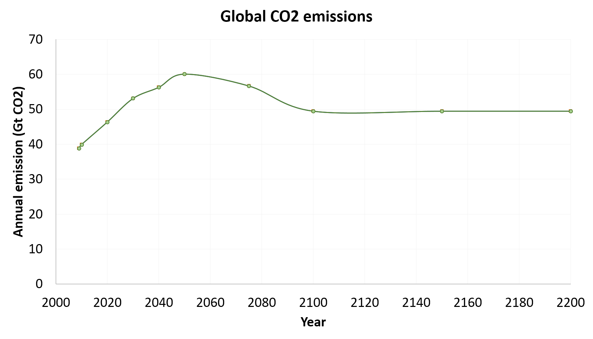

# Validation

This guide briefly explains how Mimi PAGE results were validated against PAGE 2009 outputs.

Validations were performed for both the deterministic and probabilistic versions of the model. For the deterministic version of the model, both individual components and final outputs were validated. For the probabilistic version of the model, final outputs were validated.

## Folder Structure

Relevant tests and data are saved in the 'test' folder. The folders are organized as follows.

**test**

Contains separate unit tests for the deterministic version of each of the individual model components.

**test/validationdata**

We obtained PAGE 2009 values from the Excel version of PAGE 2009, provided by Chris Hope (personal communication).

Running the Excel version of PAGE 2009 requires the @RISK 7.5 Industial software (available at http://go.palisade.com/RISKDownload.html), which facilitates probabilistic modeling in Excel. Free 15-day trials of the software are available

In order to perform tests of individual components, known values were
extracted from PAGE '09 or the PAGE written documentation. Where they
were obtained from PAGE 2009, values were exported with full precision
using a separate extraction tool. (Key values are saved in the `validationdata` folder within the `test` folder.) Truncating precision can lead to compounding errors which will cause Mimi PAGE results to diverge from PAGE 2009.


## Deterministic validations

For each individual Mimi PAGE component, we tested the component with known input data and compared output with values from PAGE 2009. Nearly all values matched within 1%.

As an example of how a test file works, consider `test/test_CO2emissions`, which serves as a test for the `src/components/CO2emissions.jl` file.

First, we initialize the model and reference the relevant files (`src/utils/load_paramaters.jl` and, notably, `src/components/CO2emissions.jl`). Then we add the `CO2emissions` component to our model `m`.

```
using Mimi
using Test

include("../src/utils/load_parameters.jl")
include("../src/components/CO2emissions.jl")

m = Model()
set_dimension!(m, :time, [2009, 2010, 2020, 2030, 2040, 2050, 2075, 2100, 2150, 2200])
set_dimension!(m, :region, ["EU", "USA", "OECD","USSR","China","SEAsia","Africa","LatAmerica"])

add_comp!(m, co2emissions)
```

Then we set the component inputs (baseline emissions and CO2 emissions growth) using exogenous values from PAGE 2009, which are saved in the data folder.
```
set_param!(m, :co2emissions, :e0_baselineCO2emissions, readpagedata(m, "data/e0_baselineCO2emissions.csv"))
set_param!(m, :co2emissions, :er_CO2emissionsgrowth, readpagedata(m, "data/er_CO2emissionsgrowth.csv"))
```

Then we run our model, save the output to the `emissions` variable. We
then load exogenous PAGE 2009 data on emissions into the
`emissions_compare` variable. We test to see if the output from our model matches that from PAGE within 1e-3 precision (it does).

```
##running Model
run(m)

emissions = m[:co2emissions,  :e_regionalCO2emissions]

# Recorded data
emissions_compare = readpagedata(m, "test/validationdata/e_regionalCO2emissions.csv")

@test emissions ≈ emissions_compare rtol=1e-3

```

The graph below shows the output from both PAGE 2009 and Mimi PAGE.




## Probabilistic validation

For the probabilistic version of the model, we graphed and compared
distributions of total damages, total preventative costs, total
adaptation costs, and total effects.  Differences between quantiles of
the distribution for 4 model end-point variables are shown in the
graph below. Error bars show the 95% confidence interval associated
with sampling uncertainty.

Distributions matched closely (<1.5% difference) for all outputs,
based on 100,000 runs.


